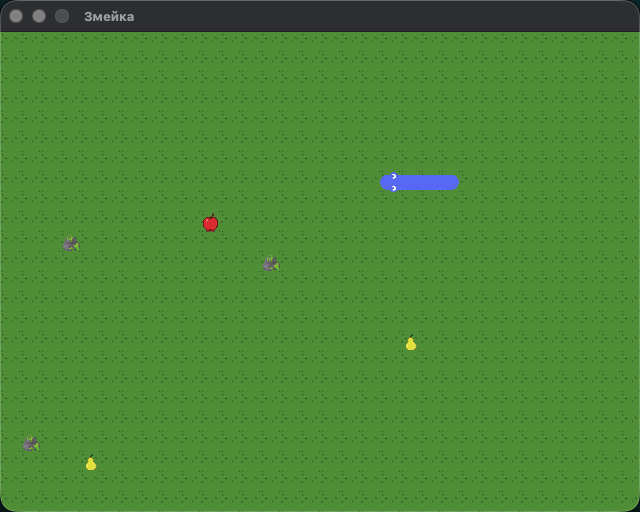

# 🐍 Игра «Змейка» с расширенной механикой

Учебный проект, разработанный в рамках обучения в **Яндекс Практикуме** / **Яндексе**. Классическая механика «Змейки» дополнена графическими текстурами и интересными игровыми элементами: динамическими препятствиями и объектами с особыми свойствами.




## ✨ Основные фичи и объекты

* 🍎 **Яблоко (`Apple`):** Увеличивает длину змейки на +1 и насыщает змейку.
* 🍐 **Груша (`Pear`):** Опасный фрукт! Съедание груши уменьшает длину змейки на **1 элемент**. Если длина змейки равна минимальной (2 сегмента), съедение груши приводит к проигрышу.
* 🪨 **Камни (`Stone`):** Непроходимые препятствия. Столкновение с любым камнем перезапускает игру.
* 🎨 **Текстуры и плавный поворот:** Использование PNG-текстур для отрисовки головы, тела, поворотов, хвоста змейки и объектов поля.
* 🌀 **Сквозные стены:** Змейка проходит сквозь границы экрана и появляется с противоположной стороны.
* 🎲 **Умный спавн:** Все объекты (яблоки, груши, камни) появляются только на свободных от змейки и других предметов клетках.

---

## 🛠 Технологии

* **Python 3.x**
* **Pygame**

---

## 🚀 Запуск проекта

1. **Клонируйте репозиторий:**
   ```bash
   git clone [https://github.com/ваш-логин/ваш-репозиторий.git](https://github.com/ваш-логин/ваш-репозиторий.git)
   cd ваш-репозиторий